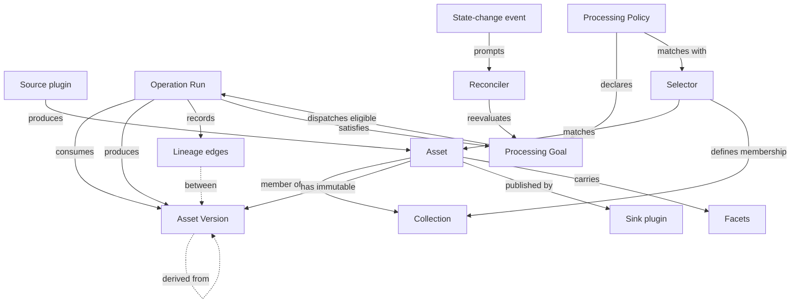

# Sidereal Architecture

**Status:** Proposed · **Tracks:** [RFC #213](https://github.com/sidereal-io/sidereal/issues/213) (`status/design`) · **Last updated:** 2026-07-31

> **Why this lives in the repo.** The [Feature & Bug Workflow](../../CLAUDE.md) says designs live in the
> issue body, not the repo tree. That rule is right for features — a feature design is scaffolding
> that stops mattering once the code ships. This document is different: it is the standing answer to
> "what is this system and where is it going," and it needs to outlive the issue that produced it.
> Issue #213 is the *proposal*; this is the *reference*. Keep them in sync while #213 is open; after
> it closes, this file is the surviving record.
>
> **The architecture as a whole is not accepted yet.** #213 remains in `status/design`; individual
> ADRs may record decisions approved during review.

## Contents

- [Where we are](#where-we-are) — v0.10.x, honestly
- [Where we're going](#where-were-going) — the north star
- [Core concepts](#core-concepts) — Asset · Collection · Selector · Lineage · Processing Goal · Operation Run
- [Plugin model](#plugin-model) — the summary; full contract in [plugins.md](plugins.md)
- [Core and domain packs](#core-and-domain-packs) — the facet mechanism
- [Open seams](#open-seams) — what is deliberately undecided
- [Milestone map](#milestone-map) — M0 → M7

---

## Where we are

Sidereal v0.10.x is **a viewer over an Immich library**. This is a fair description, not a
disparaging one — it does that job well, and it is the shipped, supported product until cutover.

The data model has exactly one asset concept: an `Image`, synced from Immich, already finished,
with plate-solve results attached. Immich is the source of truth; Sidereal mirrors it read-only.
An asset disappearing from Immich deletes the Sidereal record.

Everything else in the model hangs off that single `Image`:

```
ImageSource (local|url|immich) ──ingests──▶ Image
                                             ├── 1..* PlateSolvingJob
                                             ├── 1..* AcquisitionEntry ──▶ Equipment (filter)
                                             ├── *..* Equipment (link + per-image settings)
                                             └── targetName ┄soft ref┄▶ CatalogObject
EquipmentGroup *..* Equipment ──apply──▶ Image links
UserTarget ┄soft ref┄▶ CatalogObject
```

A "target" is not an entity — it is `GROUP BY targetName` computed at read time, enriched from the
OpenNGC catalog when the name happens to match. Integration totals are derived by recomputing
summary fields on the `Image` row whenever acquisitions or equipment links change.

The full externally-observable behaviour is catalogued in the
[behavioural specification package](https://github.com/sidereal-io/sidereal-analysis) (private).
Treat it as **an inventory of what not to forget**, not as a compatibility contract — see
[Migration](#migration-and-cutover).

### What this model cannot express

Astrophotography produces three things the current model has no shape for:

- **Calibration frames in sets** — 50 darks at a given temperature, gain, and exposure; masters
  derived from them and reused across months of sessions.
- **Lights by the hundreds per session**, as FITS/XISF, long before anything is presentable.
- **Stacked results with provenance** — "these 187 lights, this master dark, this master flat,
  integrated on this date."

The highest-value question a user can ask — *"what did I use this master dark on, and is it still
valid for this camera at this temperature?"* — is unanswerable today, because lineage is not
modelled at all.

---

## Where we're going

**Product:** an astrophotography processing system that manages photos at *all* stages of the hobby —
calibration frames, raw lights, stacked results, annotated finals.

**Codebase:** a rewrite with a Rust backend, a plugin system for input/output formats and operations,
and a web frontend for managing assets, processing, and metadata.

Three commitments shape everything below:

1. **Sidereal becomes the system of record for files on disk.** It renames, moves, and organises
   them. Today it mirrors someone else's tree; in v2 it owns one.
2. **Sidereal does not do the math.** Calibration, registration, and integration stay in
   Siril / PixInsight / APP. Sidereal may invoke them through plugins. It does not
   reimplement them.
3. **Every processing action is a plugin, including the built-in ones.** This is what keeps the
   plugin interface honest — see [plugins.md](plugins.md).

**Not an Immich replacement.** The core is built so it doesn't *forbid* general media management,
but that future is explicitly unfunded. Immich's hard parts — ML at scale, mobile apps with
background upload, multi-user sharing — are not needed for the astro product, and any one of them
would eat a year.

---

## Core concepts

Six concepts that do not exist today. These are the load-bearing additions; everything else in v2
is a consequence of them.



### Asset

One logical file managed by Sidereal. It has a stable opaque identity, a path, a `kind`, labels,
extracted metadata (as [facets](#core-and-domain-packs)), and one or more immutable `AssetVersion`
records. Each version identifies an exact byte state by content hash.

**Identity is immutable and independent of path.** Renaming or moving a file changes the path, not
the asset. This is the invariant that makes Sidereal safe to let loose on a user's filesystem: if
identity were path-derived, the system reorganising a tree would destroy its own references.

`kind` is **not** a fixed enum. `light | dark | flat | master | stacked` is astro vocabulary
contributed by the astro domain pack, not core vocabulary. See
[Core and domain packs](#core-and-domain-packs).

> ◇ **Proposed — [ADR-003](../decisions/ADR-003-storage-layout-and-asset-identity.md):** stable
> surrogate Asset identity plus immutable content-addressed AssetVersions. The exact on-disk tree and
> retention policy remain part of the decision.

### Collection

A generic grouping of assets. A **session** — target, date, location, rig, frames — is one
specialisation; an album is another. A Collection may have explicit membership or a Selector that
defines dynamic membership. Processing always binds a specific immutable membership snapshot, so a
Collection changing underneath a run cannot change its inputs retroactively.

Derived values are always derived. Integration totals are computed from member assets and their
facets; they are never typed in and never denormalised onto a row that can drift. (v0.10.x does
denormalise them onto the `Image` row, which is why a manual edit to `frameCount` survives until the
next recompute silently overwrites it.)

### Selector and labels

A **Selector** is the shared, deterministic predicate for deciding what applies to an AssetVersion or
Collection. The common selector vocabulary covers `kind`, labels, source instance, typed facets, and
Collection membership. Core owns evaluation, indexing, and a match explanation; plugins and domain
packs supply selector data and definitions, not custom matching code.

**Labels** are namespaced string key/value classification intended for selection — cheap to index,
easy to configure, and safe to show in the UI. Facets are typed, schema-owned facts such as exposure
or sensor temperature. `kind` remains the domain pack's distinguished type discriminator. Selectors
may combine all three rather than forcing rich metadata into strings.

A Source configuration may assign an initial `kind` and fixed labels to every asset it ingests. The
Source may also propose detected labels or facets within its grants, but it never chooses Operators.
Changing labels, kind, facets, or selector-backed Collection membership prompts reconciliation.
Source types and domain packs may offer label defaults; the configured Source instance owns the
final defaults. A mixed-kind Source may leave `kind` unset initially or classify each asset from
ingested metadata.

Selectors serve three related purposes:

1. A Processing Policy selector decides **which goals apply** to a subject.
2. An Operator `accepts` selector decides **whether that implementation can satisfy** a goal for the
   subject.
3. A Collection selector decides **which assets are members** of a dynamic Collection.

Conceptually, without fixing the manifest syntax:

```
Source defaults:       kind=astro.stacked, label processing.sidereal.io/mode=auto
Policy selector:       kind=astro.stacked + processing.sidereal.io/mode=auto
                       → require metadata, solve, thumbnail
Plate-solve Operator:  provides solve; accepts astro image kinds with readable bytes
Collection selector:   label astro.sidereal.io/target=M31 + kind=astro.light
```

Core dispatches an Operator only when the policy selected the subject, the Operator provides the
missing outcome, its `accepts` selector matches, and its prerequisites are satisfied. The selector
and the evidence used to match it are recorded so “why did this run?” remains answerable.

The selector language is deliberately bounded: boolean composition plus existence, equality, set,
and typed facet comparisons. It is data, not arbitrary plugin code, so matching remains indexable and
explainable. Core rejects dependency cycles between selector-backed Collections.

### Lineage

Directed edges between immutable AssetVersions recording exactly which bytes were derived from which:

```
stacked_M31_2026-03-14  ←  [187 × light]  +  [master_dark_v3]  +  [master_flat_Ha]
master_dark_v3          ←  [50 × dark @ -10°C, gain 100, 300s]
```

This is the single highest-value thing the current application cannot do, and the reason the rewrite
is a rewrite rather than a refactor.

An Asset is the stable logical identity used by collections, links, and external mappings. Lineage
and Operation Runs point to immutable versions, so a move does not disturb references and a
byte-level rewrite cannot erase history. Path-only moves remain Asset events; byte changes produce a
new version. [ADR-003](../decisions/ADR-003-storage-layout-and-asset-identity.md) fixes the complete
identity, revision, reconciliation, and retention rules.

### Processing Goal

A durable statement of an outcome that must become true for a specific AssetVersion or immutable
Collection snapshot — for example `metadata.extracted`, `astro.plate_solved`,
`thumbnail.available`, or `published:immich`. A versioned **Processing Policy** uses a Selector to
declare the desired outcomes for matching assets and collections; it does not prescribe an Operator
sequence.

The reconciler compares desired outcomes with recorded facets, artifacts, lineage, and external
receipts. It dispatches any eligible Operator capable of satisfying a missing goal, then reevaluates.
Operators declare their prerequisites and outcomes, so only real data dependencies impose ordering;
independent work may run concurrently. Completion means every applicable goal is satisfied, not that
a workflow cursor reached its final step.

State-change events such as asset ingestion prompt reconciliation, but they are not the source of
truth. A periodic sweep repairs missed events and resumes after crashes. Manual actions use the same
model by adding an explicit goal. Before cutover, domain packs supply built-in policies; user-authored
policy rules and their editor arrive later.

An unsatisfied goal is always inspectable as `pending`, `running`, `blocked`, or `needs_attention`,
with the missing prerequisite, active attempt, retry budget, or ambiguous external effect recorded.
There is no long-lived Pipeline Run to become opaquely stuck.

### Operation Run

A job record: which Operator and version ran, which Processing Goals it attempted, exact input and
output AssetVersions, params, causal and idempotency keys, side-effect state, status, and log output.

History is exact because intent and content versions are recorded rather than reconstructed from side
effects. Re-run eligibility is determined by the Operator's side-effect class and idempotency
protocol; an ambiguous external publish is not blindly replayed. This is also the unit that progress,
retries, cancellation, and concurrency limits attach to.

---

## Plugin model

Three capabilities, one registration mechanism. A plugin may implement more than one — Immich is
both a Source and a Sink.

| Capability | Contract | Examples |
|---|---|---|
| **Source** | Produces assets | Watch folder · Immich import · NINA/SGP session output · manual upload |
| **Operator** | Takes assets + params, produces mutations and/or new assets | Plate solve · rename · move · tag · extract metadata · *later:* Siril invocation, AI detection |
| **Sink** | Publishes assets outward | Immich · static gallery · Astrobin · S3 |

All built-in functionality uses the same semantic contract and conformance suite. Execution profiles
may differ: trusted hot-path behavior can be compiled Rust, lightweight public plugins use embedded
Rhai, and heavy or OS-specific integrations use an external provider. Every profile receives the
same capability-limited `AssetContext`; none receives an unconstrained filesystem back door.

Source, Operator, and Sink contracts are versioned independently and freeze only after each is
dogfooded by realistic consumers. At least two initial built-ins also ship as Rhai plugins to prove
the public scripting surface.

The full contract — manifest, capability declaration, config schema, execution model, conformance
suite — is in **[plugins.md](plugins.md)**.

---

## Core and domain packs

If Sidereal could plausibly become a general media manager one day, `kind` must not be a Rust enum
containing `light | dark | flat`. Splitting this now costs almost nothing. Splitting it later is a
migration.

**Core (domain-agnostic):** Asset, Collection, Selector, labels, Lineage, Processing Goal, Operation
Run, processing policy registry, plugin registry, storage layout, search/index, job queue, web shell.

**Domain packs (plugins):** the astro pack contributes the `light/dark/flat/master/stacked`
vocabulary, FITS/XISF readers, the OpenNGC catalog, plate solving, sky map, equipment, acquisitions,
and visibility math. A future family-photos pack would contribute faces, duplicates, and EXIF-centric
views. Neither is privileged in core.

### The mechanism: metadata facets

Rather than a wide table of astro columns, an asset carries **namespaced, searchable facets** whose
schemas are declared by a pack:

```
astro.fits.exptime        astro.solve.ra          photo.exif.iso
astro.fits.ccd_temp       astro.solve.pixscale    photo.exif.lens
astro.fits.gain           astro.solve.fov         ai.faces.count
```

Core knows how to store, index, and query facets. It does not know what any of them mean. A pack
exclusively owns each schema, but compatible producer plugins can receive write grants. Values retain
producer and version provenance; [ADR-008](../decisions/ADR-008-facet-schema-and-write-authority.md)
defines the namespace and evolution rules.

Labels and facets are deliberately distinct. Labels are small string classifications used heavily by
Selectors; facets are typed metadata with schema evolution and producer provenance. A label such as
`processing.sidereal.io/mode=auto` can opt an asset into a policy, while
`astro.fits.ccd_temp=-10.2` remains a numeric facet available to a range predicate.

This is also what makes **per-kind processing policies** natural later. A policy matches on kind,
labels, and facets, so `kind = light` requires one set of outcomes and `kind = dark` another, with no
core changes. Calibration-master matching — "find a master dark for this camera at -10 °C, gain 100,
300 s, bin 1×1" — is a facet query, not bespoke schema.

**What this requires of the storage engine** (input to ADR-004, which is otherwise open):

- Indexed lookup on semi-structured facet values.
- Recursive traversal for lineage graphs ("everything derived from this master, transitively").
- No hard dependency on a server database for single-user installs.

SQLite (JSON1 + recursive CTEs) and PostgreSQL both satisfy all three, so the architecture does not
force the choice. ADR-004 picks on other grounds.

---

## Open seams

Points where a reader would otherwise assume something is settled. Each has a stub ADR; all are M0
work.

| # | Seam | Affects | Leaning |
|---|---|---|---|
| [ADR-001](../decisions/ADR-001-plugin-boundary.md) | **Plugin contract and execution profiles** — built-in Rust · embedded Rhai · external provider | Installation, capability isolation, performance, non-Rust authorship | Capability-oriented hybrid |
| [ADR-002](../decisions/ADR-002-core-domain-pack-split.md) | **Core / domain-pack seam** — where exactly it falls, and whether packs are compiled in or loaded | How much of the astro feature set is separable work | None stated |
| [ADR-003](../decisions/ADR-003-storage-layout-and-asset-identity.md) | **Storage layout and identity** — stable Assets, immutable AssetVersions, on-disk tree | Lineage integrity, dedup, revision retention, rename cost | Stable Asset plus immutable versions |
| [ADR-004](../decisions/ADR-004-database-engine-and-schema.md) | **Database engine and schema strategy** | Deployment story, facet indexing, migration tooling | Keep SQLite-default / Postgres-optional |
| [ADR-005](../decisions/ADR-005-frontend-continuity.md) | **Frontend continuity** — evolve the existing React app against the new API, or start fresh | Whether M5 begins from a working codebase; contributor continuity | None stated |
| [ADR-006](../decisions/ADR-006-rule-engine-deferral.md) | **Declarative processing, selectors, and policy deferral** — match subjects and reconcile desired outcomes; defer user-authored policy rules | Applicability, Collection membership, and whether M2 needs workflows or convergent goal processing | Shared selectors and reconciliation in M2; policy editor in M7 |
| [ADR-007](../decisions/ADR-007-security-and-plugin-trust.md) | **Security and plugin trust** | Authentication, CORS/CSRF, grants, provider trust, secrets | Built-in single-user auth and explicit grants |
| [ADR-008](../decisions/ADR-008-facet-schema-and-write-authority.md) | **Facet schema and write authority** | Cross-plugin interoperability and schema evolution | Exclusive schema owner with producer grants |

**ADR-001 and ADR-007 are coupled.** The execution profile says how code runs; grants and
`AssetContext` say what it is allowed to do. Neither decision is complete without the other.

---

## Milestone map

Critical path is **M0 → M1 → M2**. Everything else fans out behind it. If the plugin interface is
wrong, we find out at M2 rather than M6 — that is the entire point.


| Milestone | Size | Exit criterion |
|---|---|---|
| **M0** Contracts & scaffolding | S–M | Eight ADRs accepted, including security and plugin grants; Rhai/AssetContext spike complete; CI green; a contributor goes zero-to-running in one command |
| **M1** Core spine & first plugins | L | In a disposable root, drop a file in a watched folder → it appears in the UI with extracted metadata entirely through plugin contracts |
| **M2** Operator engine & Operator API v0.1 | M–L | Operator API, `AssetContext`, selector contract, side-effect protocol, and author guide published; four built-ins consume it, at least two through Rhai; applicability explanations, durable goals, reconciliation, and recovery after missed events proven |
| **M3** Astro domain pack | L | Source labels and built-in policy selectors converge a full session from ingest — lights + darks + flats → session grouped, masters matched, lineage recorded |
| **M4** Sources, sinks & importer | M | A real v0.10.1 install imports cleanly and reports what didn't map |
| **M5** Frontend parity | L | Every non-negotiable cutover item green |
| **M6** Cutover | M | Docker parity, migration guide, beta with real users, `v2.0.0` |
| **M7+** North star proper | — | User-authored processing policies · Siril/PixInsight integration · AI plugins · general-media pack exploration |

### Parallelism

**M5 is listed last but starts at M1.** The frontend is a separate workstream against the HTTP API
and stays TypeScript/React. This is the single most important scheduling decision in the plan: it is
what keeps existing frontend contributors productive through a backend language switch.

Third-party plugin work opens at M2. The astro pack (M3) is separable from core once the interface is
frozen, so it can split across people too.

---

## Migration and cutover

**Clean break with a one-way importer**, gated on a non-negotiable feature set.

v2 is a new data model. The TypeScript app moves to maintenance — security and critical fixes only,
no features — and is retired at cutover. The importer reads an existing SQLite/Postgres database and
storage tree and produces v2 assets: best-effort, lossy where the models genuinely differ, and it
**emits a report of exactly what didn't map**.

### On the compatibility requirements in the analysis package

`13-compatibility-requirements.md` states that a replacement MUST preserve image IDs, the storage
layout `{STORAGE_PATH}/processed/{id % 1000}/{id}/…`, every API path and shape, and reconciling-sync
semantics.

**This architecture does not honour that, and cannot.** Those requirements describe a system where
Immich owns the tree and an `Image` is a finished photo. Both premises are what v2 exists to change.
The analysis package remains valuable as a behavioural inventory and as the source of the cutover
gate below — but it is not a contract v2 is bound by.

### Non-negotiable before cutover

An existing user would consider the upgrade broken without these:

- [ ] Gallery browse / filter / search with deep links
- [ ] Image detail view and metadata editing
- [ ] Deep-zoom viewer
- [ ] Plate solving, single and bulk
- [ ] Targets: catalog browse, visibility, annotations
- [ ] Equipment and equipment groups
- [ ] Acquisition entries and integration totals
- [ ] Immich sync as a source
- [ ] Admin configuration UI with connection tests
- [ ] Docker parity — port 5000, volume mounts, PUID/PGID, healthcheck
- [ ] Saved locations and their session relationships
- [ ] One-way importer from v0.10.x with dry-run and reconciliation report

**Should-have, not blocking:** sky map with FOV overlay · notifications · live job updates ·
dashboard stats.

**Proposed compatibility breaks pending a deployment survey/data scan:** XMP sidecar generation ·
standalone worker mode. Current evidence establishes uncertain lifecycle or usage, not absence of
users. Before accepting the break, survey deployments and inspect available configuration/telemetry;
if dropped, the importer reports affected records explicitly.

**Explicitly dropped:** the database-download API endpoint (unauthenticated full-database download;
replaced by documented volume backup) · legacy free-text `telescope`/`camera`/`mount` fields
(superseded by equipment relations).

**Pre-cutover filesystem safety:** M1–M5 builds operate only on copied or disposable storage roots.
They do not rename, move, or delete irreplaceable originals. The importer is read-only against the
source tree, supports dry-run and resumable execution, records legacy-ID mappings, verifies checksums,
and reconciles source/destination counts. Its hard invariant is that every irreplaceable local or URL
original is either imported and verified or named in the failure report; an unaccounted original
blocks cutover.

**Rollback:** before M6, rollback means discarding the disposable v2 root while v0.10.x and its source
tree remain untouched. At M6, the migration guide requires a verified database and storage backup
before import. After cutover, rollback restores that backup. The importer remains one-way by design.

---

## What this document is not

- **Not a plan.** Milestones become sub-issues under #213; the plan lives there.
- **Not accepted.** #213 has not passed its approval gate. Until it does, this describes a proposal.
- **Not a v0.10.x reference.** [Where we are](#where-we-are) is a summary; the authoritative record of
  current behaviour is the [analysis package](https://github.com/sidereal-io/sidereal-analysis).

### Changing it

Architectural changes go through an ADR in [`docs/decisions/`](../decisions/), then this document is
updated in the same PR. If you are resolving one of the [open seams](#open-seams), fill in the stub
ADR's Decision section, flip its status to Accepted, and replace the ◇ marker here with what was
decided.
