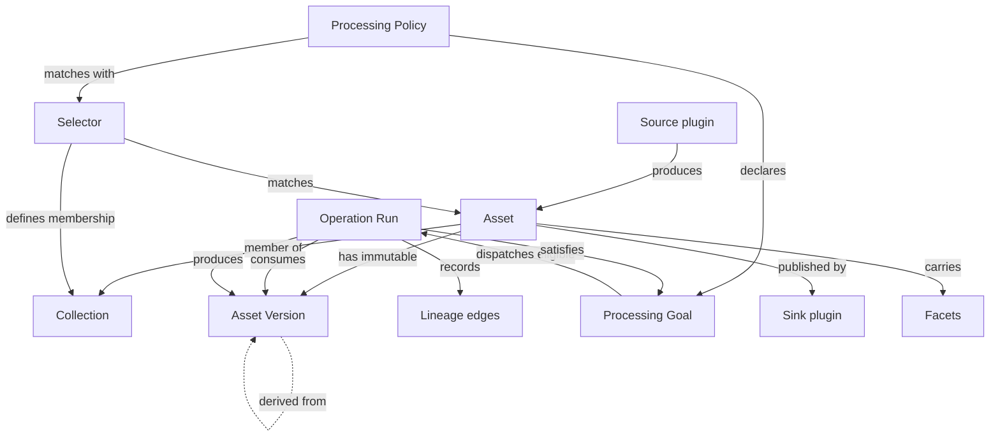

# Sidereal Architecture

**Architecture reference:** current · **Open architecture decisions:** none — all M0 ADRs accepted · **Tracks:** [RFC #213](https://github.com/sidereal-io/sidereal/issues/213) · **Last updated:** 2026-08-26

> **How to use this map.** This file owns the **architectural map** — the north star and a glossary of
> the load-bearing concepts — and points to, without restating, the documents that own each thing:
>
> - **Why each decision was made** → the ADRs in [`docs/decisions/`](../decisions/); the
>   [decision index](#architecture-decisions) below is their canonical status.
> - **The plan** — milestones, sequencing → [roadmap.md](roadmap.md) and [RFC #213](https://github.com/sidereal-io/sidereal/issues/213).
> - **Cutover execution** — checklist, rollback → [migration.md](migration.md).
> - **Current v0.10.x behaviour** → the [analysis package](https://github.com/sidereal-io/sidereal-analysis) — an inventory, not a compatibility contract.
>
> Where the decision index marks an ADR **Proposed**, the approach here is a leaning, not a commitment.
> Change this map through an ADR, then update it in the same PR.

## Where we are

Sidereal v0.10.x is **a viewer over an Immich library** — and a good one, supported until cutover. Its
data model has exactly one asset concept: an `Image`, synced read-only from Immich, already finished,
with plate-solve results attached. A "target" is not an entity; it is `GROUP BY targetName` computed at
read time. The full current behaviour is catalogued in the
[analysis package](https://github.com/sidereal-io/sidereal-analysis) (private) — an inventory of what
not to forget, not a compatibility contract.

What this model **cannot** express, and v2 must:

- **Calibration frames in sets** — 50 darks at a temperature/gain/exposure; masters reused for months.
- **Lights by the hundreds per session**, as FITS/XISF, long before anything is presentable.
- **Stacked results with provenance** — "these 187 lights, this master dark, this master flat,
  integrated on this date." Lineage is not modelled at all today; that gap is why the rewrite is a
  rewrite.

## Where we're going

**Product:** an astrophotography system that manages photos at *every* stage — calibration frames, raw
lights, stacked results, annotated finals. **Codebase:** a
[Rust backend](../decisions/ADR-009-backend-language.md), a plugin system for input/output formats and
operations, and a TypeScript/React frontend. Three commitments shape everything below:

1. **Sidereal becomes the system of record for files on disk** — it renames, moves, and organises them.
2. **Sidereal does not do the math.** Calibration, registration, and integration stay in
   Siril/PixInsight/APP, invoked through plugins. It does not reimplement them.
3. **Every processing action is a plugin, including the built-in ones** — this is what keeps the plugin
   interface honest.

**Not an Immich replacement.** The core does not *forbid* general media management, but that future is
unfunded — Immich's hard parts (ML at scale, mobile apps, multi-user sharing) are not needed for the
astro product.

## Core concepts

Seven load-bearing additions that do not exist today; everything else in v2 is a consequence of them.

**Asset** — one logical file. Stable opaque identity, independent of path, so the system reorganising a
tree never destroys its own references. Carries a small core-owned envelope (`id`, `kind`, `name`) plus
typed [facets](#core-and-domain-packs), and one or more immutable `AssetVersion` records.
→ [ADR-003](../decisions/ADR-003-storage-layout-and-asset-identity.md),
[ADR-008](../decisions/ADR-008-facet-schema-and-write-authority.md)

**AssetVersion** — an exact byte state, content-addressed by hash. A rename/move is a path event and
creates no version; any byte change creates a new immutable version. Lineage and Operation Runs point
at versions, never at the mutable Asset. → [ADR-003](../decisions/ADR-003-storage-layout-and-asset-identity.md)

**Collection** — a generic grouping (a session, an album). Membership is explicit or defined by a
Selector. Processing binds an immutable membership snapshot, so a Collection changing underneath a run
cannot alter its inputs.

**Selector** — the shared, deterministic predicate for "what does this apply to." A bounded language
(boolean composition + existence/equality/set/typed-facet comparisons) over `kind`, source, facets, and
membership — data, not plugin code, so matching stays indexable and explainable. One primitive answers
three questions: which goals apply to a subject, which Operator can satisfy a goal, and which assets are
members of a dynamic Collection. → [ADR-006](../decisions/ADR-006-rule-engine-deferral.md)

**Lineage** — directed edges between immutable AssetVersions recording exactly which bytes derived from
which (`stacked ← 187 lights + master_dark_v3 + master_flat_Ha`). The single highest-value thing v0.10.x
cannot do. → [ADR-003](../decisions/ADR-003-storage-layout-and-asset-identity.md)

**Processing Goal** — a durable statement of an outcome that must become true for a version or snapshot
(`metadata.extracted`, `astro.plate_solved`, `published:immich`). A versioned **Processing Policy** uses
a Selector to declare desired outcomes; it does not prescribe an Operator sequence. A level-triggered
reconciler compares desired outcomes with recorded state and dispatches any eligible Operator, so only
real data dependencies impose ordering and missed events recover on a sweep. An unsatisfied goal is
always inspectable (`pending`/`running`/`blocked`/`needs_attention`) — no pipeline cursor to get
opaquely stuck. → [ADR-006](../decisions/ADR-006-rule-engine-deferral.md)

**Operation Run** — the exact record of one Operator attempt: which Operator/version ran, the goals it
addressed, input and output versions, params, idempotency key, side-effect state, status, and logs.
Re-run eligibility follows the Operator's side-effect class; an ambiguous external publish is not blindly
replayed. → [ADR-006](../decisions/ADR-006-rule-engine-deferral.md)

How they relate (reference, not a flow):

## Plugin model

Three capabilities, one registration mechanism; a plugin may implement more than one (Immich is both
Source and Sink).

| Capability | Contract | Examples |
|---|---|---|
| **Source** | Produces assets | Watch folder · Immich import · NINA/SGP output · manual upload |
| **Operator** | Takes assets + params → mutations and/or new assets | Plate solve · rename · move · tag · extract metadata · *later:* Siril, AI detection |
| **Sink** | Publishes assets outward | Immich · static gallery · Astrobin · S3 |

All profiles implement the same semantic contract and conformance suite; only the transport differs
(built-in Rust, embedded script, or external provider), and every profile receives the same
capability-limited `AssetContext` — no filesystem back door. The full contract is in
**[plugins.md](plugins.md)**; the execution profiles and trust model are
[ADR-001](../decisions/ADR-001-plugin-boundary.md) and
[ADR-007](../decisions/ADR-007-security-and-plugin-trust.md).

## Core and domain packs

`kind` must not be a Rust enum containing `light | dark | flat`. **Core** is domain-agnostic (Asset,
Collection, Selector, Lineage, Processing Goal, Operation Run, plugin/policy registries, storage, search,
job queue, web shell). **Domain packs** are plugins: the astro pack contributes the
`light/dark/flat/master/stacked` vocabulary, FITS/XISF readers, OpenNGC catalog, plate solving, sky map,
equipment, acquisitions, and visibility math. → [ADR-002](../decisions/ADR-002-core-domain-pack-split.md)

The mechanism is **namespaced, searchable facets** (`astro.fits.ccd_temp`, `astro.solve.ra`,
`photo.exif.iso`). Core stores, indexes, and queries facets without knowing what any of them mean; a pack
owns each schema, and compatible producers get write grants with retained provenance. This is what makes
calibration-master matching — "a master dark for this camera at −10 °C, gain 100, 300 s, bin 1×1" — a
facet query rather than bespoke schema. → [ADR-008](../decisions/ADR-008-facet-schema-and-write-authority.md)

## Architecture decisions

Each decision has an ADR in [`docs/decisions/`](../decisions/) with the full context, options, and
rationale. All M0 ADRs are now **Accepted**.

| ADR | Decision | Status |
|---|---|---|
| [001](../decisions/ADR-001-plugin-boundary.md) | Plugin contract & execution profiles | Accepted |
| [002](../decisions/ADR-002-core-domain-pack-split.md) | Core / domain-pack seam | Accepted |
| [003](../decisions/ADR-003-storage-layout-and-asset-identity.md) | Storage layout & asset identity | Accepted |
| [004](../decisions/ADR-004-database-engine-and-schema.md) | Database engine & schema strategy | Accepted (PostgreSQL-only) |
| [005](../decisions/ADR-005-frontend-continuity.md) | Frontend continuity | Accepted (Option C — new shell, port components) |
| [006](../decisions/ADR-006-rule-engine-deferral.md) | Declarative processing & policy deferral | Accepted |
| [007](../decisions/ADR-007-security-and-plugin-trust.md) | Security & plugin trust | Accepted |
| [008](../decisions/ADR-008-facet-schema-and-write-authority.md) | Metadata envelope, facets & write authority | Accepted |
| [009](../decisions/ADR-009-backend-language.md) | Backend language & runtime | Accepted (Rust) |
| [010](../decisions/ADR-010-migration-strategy.md) | Migration strategy | Accepted (clean break + one-way importer) |
| [011](../decisions/ADR-011-storage-tree-layout.md) | Storage tree layout & cross-filesystem moves | Accepted (Option B — BLAKE3 internal object store) |

**ADR-001 and ADR-007 are coupled** — the execution profile says how code runs; grants and
`AssetContext` say what it may do. Neither is complete without the other.

## Design facts

Settled calls that don't warrant an ADR — no significant alternative to weigh, or cheap to reverse.
Anything with real trade-offs is an ADR (table above); product scope lives in RFC #213. If a fact grows
a contested *why*, promote it to an ADR and it becomes a row above.

- **The frontend stays TypeScript/React** through the backend's move to Rust — the deliberate continuity
  that keeps current contributors productive. (How it starts — a new shell with ported components — is
  settled in [ADR-005](../decisions/ADR-005-frontend-continuity.md).)
- **Derived values are always computed, never stored** — integration totals and the like are recomputed
  from member assets and their facets, never denormalised onto a row that can drift (a v0.10.x mistake
  we don't repeat).
- **A plugin may implement multiple capabilities** — Immich is both a Source and a Sink; the
  registration mechanism is one.

## Build shape

Critical path is **M0 → M1 → M2**; if the plugin interface is wrong, we find out at M2 rather than M6.
The milestone map, exit criteria, and parallelism are in **[roadmap.md](roadmap.md)**; milestones are
tracked as sub-issues under [#213](https://github.com/sidereal-io/sidereal/issues/213).

## Migration & cutover

Decision in [ADR-010](../decisions/ADR-010-migration-strategy.md); the cutover gate — checklist,
compatibility breaks, filesystem-safety invariants, and rollback — in **[migration.md](migration.md)**.
