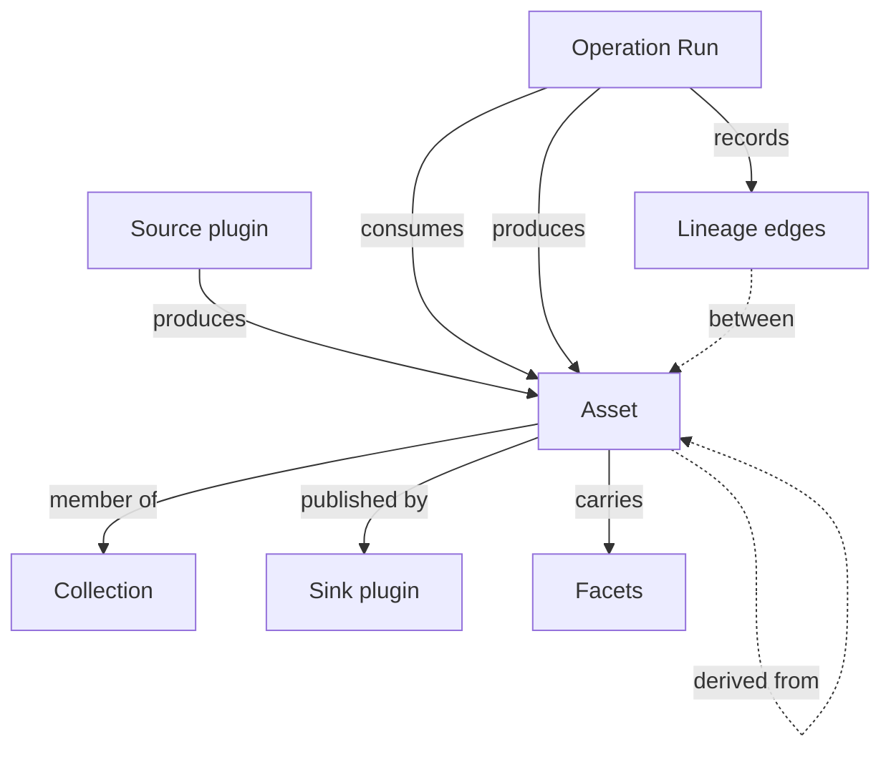
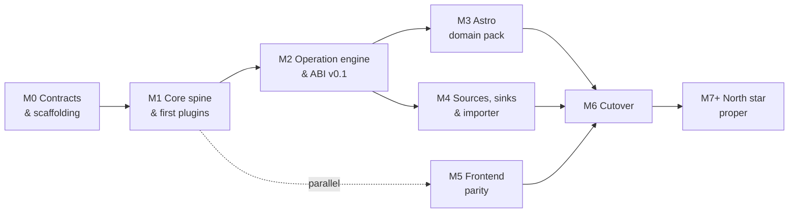

# Sidereal Architecture

**Status:** Proposed · **Tracks:** [RFC #213](https://github.com/sidereal-io/sidereal/issues/213) (`status/design`) · **Last updated:** 2026-07-29

> **Why this lives in the repo.** The [Feature & Bug Workflow](../../CLAUDE.md) says designs live in the
> issue body, not the repo tree. That rule is right for features — a feature design is scaffolding
> that stops mattering once the code ships. This document is different: it is the standing answer to
> "what is this system and where is it going," and it needs to outlive the issue that produced it.
> Issue #213 is the *proposal*; this is the *reference*. Keep them in sync while #213 is open; after
> it closes, this file is the surviving record.
>
> **Nothing here is accepted yet.** #213 is in `status/design` and has not passed its approval gate.

## Contents

- [Where we are](#where-we-are) — v0.10.x, honestly
- [Where we're going](#where-were-going) — the north star
- [Core concepts](#core-concepts) — Asset · Collection · Lineage · Operation Run
- [Plugin model](#plugin-model) — the summary; full contract in [plugins.md](plugins.md)
- [Core and domain packs](#core-and-domain-packs) — the facet mechanism
- [Open seams](#open-seams) — what is deliberately undecided
- [Milestone map](#milestone-map) — M0 → M7

---

## Where we are

Sidereal v0.10.x is **a viewer over an Immich library**. This is a fair description, not a
disparaging one — it does that job well, and it is the shipped, supported product until cutover.

The data model has exactly one asset concept: an `Image`, synced from Immich, already finished,
with plate-solve results attached. Immich is the source of truth; Sidereal mirrors it read-only.
An asset disappearing from Immich deletes the Sidereal record.

Everything else in the model hangs off that single `Image`:

```
ImageSource (local|url|immich) ──ingests──▶ Image
                                             ├── 1..* PlateSolvingJob
                                             ├── 1..* AcquisitionEntry ──▶ Equipment (filter)
                                             ├── *..* Equipment (link + per-image settings)
                                             └── targetName ┄soft ref┄▶ CatalogObject
EquipmentGroup *..* Equipment ──apply──▶ Image links
UserTarget ┄soft ref┄▶ CatalogObject
```

A "target" is not an entity — it is `GROUP BY targetName` computed at read time, enriched from the
OpenNGC catalog when the name happens to match. Integration totals are derived by recomputing
summary fields on the `Image` row whenever acquisitions or equipment links change.

The full externally-observable behaviour is catalogued in the
[behavioural specification package](https://github.com/sidereal-io/sidereal-analysis) (private).
Treat it as **an inventory of what not to forget**, not as a compatibility contract — see
[Migration](#migration-and-cutover).

### What this model cannot express

Astrophotography produces three things the current model has no shape for:

- **Calibration frames in sets** — 50 darks at a given temperature, gain, and exposure; masters
  derived from them and reused across months of sessions.
- **Lights by the hundreds per session**, as FITS/XISF, long before anything is presentable.
- **Stacked results with provenance** — "these 187 lights, this master dark, this master flat,
  integrated on this date."

The highest-value question a user can ask — *"what did I use this master dark on, and is it still
valid for this camera at this temperature?"* — is unanswerable today, because lineage is not
modelled at all.

---

## Where we're going

**Product:** an astrophotography imaging pipeline that manages photos at *all* stages of the hobby —
calibration frames, raw lights, stacked results, annotated finals.

**Codebase:** a rewrite with a Rust backend, a plugin system for input/output formats and operations,
and a web frontend for managing the pipeline and its metadata.

Three commitments shape everything below:

1. **Sidereal becomes the system of record for files on disk.** It renames, moves, and organises
   them. Today it mirrors someone else's tree; in v2 it owns one.
2. **Sidereal does not do the math.** Calibration, registration, and integration stay in
   Siril / PixInsight / APP. Sidereal may *orchestrate* them through plugins. It does not
   reimplement them.
3. **Every pipeline action is a plugin, including the built-in ones.** This is what keeps the
   plugin interface honest — see [plugins.md](plugins.md).

**Not an Immich replacement.** The core is built so it doesn't *forbid* general media management,
but that future is explicitly unfunded. Immich's hard parts — ML at scale, mobile apps with
background upload, multi-user sharing — are not needed for the astro product, and any one of them
would eat a year.

---

## Core concepts

Four concepts that do not exist today. These are the load-bearing additions; everything else in v2
is a consequence of them.



### Asset

One file on disk. Has a `kind`, a format, a content hash, and extracted metadata (as
[facets](#core-and-domain-packs)).

**Identity is immutable and independent of path.** Renaming or moving a file changes the path, not
the asset. This is the invariant that makes Sidereal safe to let loose on a user's filesystem: if
identity were path-derived, the system reorganising a tree would destroy its own references.

`kind` is **not** a fixed enum. `light | dark | flat | master | stacked` is astro vocabulary
contributed by the astro domain pack, not core vocabulary. See
[Core and domain packs](#core-and-domain-packs).

> ◇ **Open — [ADR-003](../decisions/ADR-003-storage-layout-and-asset-identity.md):** whether identity
> is the content hash or a surrogate ID, and the on-disk tree shape. **This one is not purely a
> mechanism choice** — see the tension noted under [Lineage](#lineage) before deciding it.

### Collection

A generic grouping of assets. A **session** — target, date, location, rig, frames — is one
specialisation; an album is another.

Derived values are always derived. Integration totals are computed from member assets and their
facets; they are never typed in and never denormalised onto a row that can drift. (v0.10.x does
denormalise them onto the `Image` row, which is why a manual edit to `frameCount` survives until the
next recompute silently overwrites it.)

### Lineage

Directed edges between assets recording what was derived from what:

```
stacked_M31_2026-03-14  ←  [187 × light]  +  [master_dark_v3]  +  [master_flat_Ha]
master_dark_v3          ←  [50 × dark @ -10°C, gain 100, 300s]
```

This is the single highest-value thing the current application cannot do, and the reason the rewrite
is a rewrite rather than a refactor.

> **Architectural tension worth resolving early.** Lineage edges point at asset identities. If
> identity *is* the content hash, then any operation that rewrites an asset's bytes changes its
> identity and silently orphans every edge pointing at it. Two ways out, and ADR-003 must pick one
> explicitly:
>
> - **Surrogate identity** — assets have a stable ID; the content hash is a recorded *property* used
>   for dedup and integrity checking, not the primary key.
> - **Content-hash identity plus immutability** — operations never mutate bytes in place; any
>   byte-level change produces a *new* asset with a lineage edge to its predecessor.
>
> Both are coherent. The second is cleaner in theory and pushes real cost onto every rename-adjacent
> operation and onto disk usage. Deciding this late means discovering it at M3, with the astro pack
> already built on the wrong assumption.

### Operation Run

A job record: which plugin, which inputs, which params, what it produced, status, and log output.

History and re-runnability come free — "re-run this solve with different params" is replaying a
record, not reconstructing intent from side effects. This is also the unit that progress reporting,
retries, and concurrency limits attach to.

---

## Plugin model

Three capabilities, one registration mechanism. A plugin may implement more than one — Immich is
both a Source and a Sink.

| Capability | Contract | Examples |
|---|---|---|
| **Source** | Produces assets | Watch folder · Immich import · NINA/SGP session output · manual upload |
| **Operation** | Takes assets + params, produces mutations and/or new assets | Plate solve · rename · move · tag · extract metadata · *later:* Siril invocation, AI detection |
| **Sink** | Publishes assets outward | Immich · static gallery · Astrobin · S3 |

**All built-in functionality ships as a plugin over the public interface.** No privileged internal
path exists. This is the rule that prevents the interface from drifting into something only
theoretically usable — our own features are its first four consumers, and it is frozen only after
those four exist.

The full contract — manifest, capability declaration, config schema, execution model, conformance
suite — is in **[plugins.md](plugins.md)**.

---

## Core and domain packs

If Sidereal could plausibly become a general media manager one day, `kind` must not be a Rust enum
containing `light | dark | flat`. Splitting this now costs almost nothing. Splitting it later is a
migration.

**Core (domain-agnostic):** Asset, Collection, Lineage, Operation Run, plugin registry, storage
layout, search/index, job queue, web shell.

**Domain packs (plugins):** the astro pack contributes the `light/dark/flat/master/stacked`
vocabulary, FITS/XISF readers, the OpenNGC catalog, plate solving, sky map, equipment, acquisitions,
and visibility math. A future family-photos pack would contribute faces, duplicates, and EXIF-centric
views. Neither is privileged in core.

### The mechanism: metadata facets

Rather than a wide table of astro columns, an asset carries **namespaced, searchable facets**, each
declared by the pack that owns it:

```
astro.fits.exptime        astro.solve.ra          photo.exif.iso
astro.fits.ccd_temp       astro.solve.pixscale    photo.exif.lens
astro.fits.gain           astro.solve.fov         ai.faces.count
```

Core knows how to store, index, and query facets. It does not know what any of them mean. A pack
declares its namespace, the types within it, and which facets are indexed.

This is also what makes **per-kind pipelines** natural later. A routing rule matches on kind and
facets, so `kind = light` routes to one pipeline and `kind = dark` to another, with no core changes.
Calibration-master matching — "find a master dark for this camera at -10 °C, gain 100, 300 s,
bin 1×1" — is a facet query, not bespoke schema.

**What this requires of the storage engine** (input to ADR-004, which is otherwise open):

- Indexed lookup on semi-structured facet values.
- Recursive traversal for lineage graphs ("everything derived from this master, transitively").
- No hard dependency on a server database for single-user installs.

SQLite (JSON1 + recursive CTEs) and PostgreSQL both satisfy all three, so the architecture does not
force the choice. ADR-004 picks on other grounds.

---

## Open seams

Points where a reader would otherwise assume something is settled. Each has a stub ADR; all are M0
work.

| # | Seam | Affects | Leaning |
|---|---|---|---|
| [ADR-001](../decisions/ADR-001-plugin-boundary.md) | **Plugin boundary** — in-process WASM · out-of-process subprocess/gRPC · native Rust dylib | Crash isolation, per-asset latency at scale, whether plugins can be authored outside Rust | Out-of-process — a crashing Python AI plugin shouldn't take down the server |
| [ADR-002](../decisions/ADR-002-core-domain-pack-split.md) | **Core / domain-pack seam** — where exactly it falls, and whether packs are compiled in or loaded | How much of the astro feature set is separable work | None stated |
| [ADR-003](../decisions/ADR-003-storage-layout-and-asset-identity.md) | **Storage layout and asset identity** — content-hash vs. surrogate; on-disk tree shape | Lineage integrity (see the tension above), dedup, rename cost | None stated |
| [ADR-004](../decisions/ADR-004-database-engine-and-schema.md) | **Database engine and schema strategy** | Deployment story, facet indexing, migration tooling | Keep SQLite-default / Postgres-optional |
| [ADR-005](../decisions/ADR-005-frontend-continuity.md) | **Frontend continuity** — evolve the existing React app against the new API, or start fresh | Whether M5 begins from a working codebase; contributor continuity | None stated |
| [ADR-006](../decisions/ADR-006-rule-engine-deferral.md) | **Rule engine deferral** — confirm per-kind pipelines land post-cutover | Whether M2's operation engine needs routing hooks now or later | Defer to M7 |

**ADR-001 is the biggest call.** The open question against the out-of-process leaning: does it hold
up against the latency of per-asset operations at scale — thousands of frames, per-asset IPC?

---

## Milestone map

Critical path is **M0 → M1 → M2**. Everything else fans out behind it. If the plugin interface is
wrong, we find out at M2 rather than M6 — that is the entire point.



| Milestone | Size | Exit criterion |
|---|---|---|
| **M0** Contracts & scaffolding | S–M | Six ADRs accepted; CI green; a contributor goes zero-to-running in one command |
| **M1** Core spine & first plugins | L | Drop a file in a watched folder → it appears in the UI with extracted metadata, entirely through plugin code paths |
| **M2** Operation engine & ABI v0.1 | M–L | ABI published with an author guide and a worked third-party example; all four built-ins consume it unchanged |
| **M3** Astro domain pack | L | A full session ingests — lights + darks + flats → session grouped, masters matched, lineage recorded |
| **M4** Sources, sinks & importer | M | A real v0.10.1 install imports cleanly and reports what didn't map |
| **M5** Frontend parity | L | Every non-negotiable cutover item green |
| **M6** Cutover | M | Docker parity, migration guide, beta with real users, `v2.0.0` |
| **M7+** North star proper | — | Per-kind rule pipelines · Siril/PixInsight orchestration · AI plugins · general-media pack exploration |

### Parallelism

**M5 is listed last but starts at M1.** The frontend is a separate workstream against the HTTP API
and stays TypeScript/React. This is the single most important scheduling decision in the plan: it is
what keeps existing frontend contributors productive through a backend language switch.

Third-party plugin work opens at M2. The astro pack (M3) is separable from core once the interface is
frozen, so it can split across people too.

---

## Migration and cutover

**Clean break with a one-way importer**, gated on a non-negotiable feature set.

v2 is a new data model. The TypeScript app moves to maintenance — security and critical fixes only,
no features — and is retired at cutover. The importer reads an existing SQLite/Postgres database and
storage tree and produces v2 assets: best-effort, lossy where the models genuinely differ, and it
**emits a report of exactly what didn't map**.

### On the compatibility requirements in the analysis package

`13-compatibility-requirements.md` states that a replacement MUST preserve image IDs, the storage
layout `{STORAGE_PATH}/processed/{id % 1000}/{id}/…`, every API path and shape, and reconciling-sync
semantics.

**This architecture does not honour that, and cannot.** Those requirements describe a system where
Immich owns the tree and an `Image` is a finished photo. Both premises are what v2 exists to change.
The analysis package remains valuable as a behavioural inventory and as the source of the cutover
gate below — but it is not a contract v2 is bound by.

### Non-negotiable before cutover

An existing user would consider the upgrade broken without these:

- [ ] Gallery browse / filter / search with deep links
- [ ] Image detail view and metadata editing
- [ ] Deep-zoom viewer
- [ ] Plate solving, single and bulk
- [ ] Targets: catalog browse, visibility, annotations
- [ ] Equipment and equipment groups
- [ ] Acquisition entries and integration totals
- [ ] Immich sync as a source
- [ ] Admin configuration UI with connection tests
- [ ] Docker parity — port 5000, volume mounts, PUID/PGID, healthcheck
- [ ] One-way importer from v0.10.x

**Should-have, not blocking:** sky map with FOV overlay · notifications · live job updates ·
dashboard stats · locations.

**Explicitly dropped:** XMP sidecar generation (experimental, possibly broken) · the database-download
API endpoint (unauthenticated full-database download; replaced by documented volume backup) ·
standalone worker mode (evidence suggests nobody runs it) · legacy free-text
`telescope`/`camera`/`mount` fields (superseded by equipment relations).

**Rollback:** free until M6 — v0.10.x remains the released product throughout, and abandoning the
rewrite costs only the effort spent. After M6, rollback means restoring a pre-import backup. The
importer is one-way by design, so the migration guide must make backup a required step.

---

## What this document is not

- **Not a plan.** Milestones become sub-issues under #213; the plan lives there.
- **Not accepted.** #213 has not passed its approval gate. Until it does, this describes a proposal.
- **Not a v0.10.x reference.** [Where we are](#where-we-are) is a summary; the authoritative record of
  current behaviour is the [analysis package](https://github.com/sidereal-io/sidereal-analysis).

### Changing it

Architectural changes go through an ADR in [`docs/decisions/`](../decisions/), then this document is
updated in the same PR. If you are resolving one of the [open seams](#open-seams), fill in the stub
ADR's Decision section, flip its status to Accepted, and replace the ◇ marker here with what was
decided.
