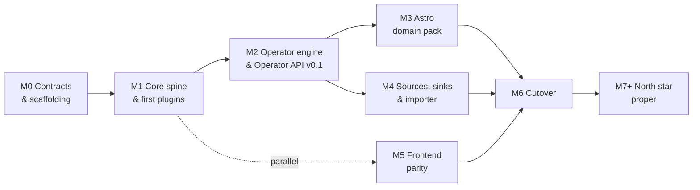

# Roadmap — Milestone Map

**Tracks:** [RFC #213](https://github.com/sidereal-io/sidereal/issues/213) · **Last updated:** 2026-08-19 ·
Part of the [architecture reference](README.md).

The build shape. Milestones are tracked as **sub-issues under [#213](https://github.com/sidereal-io/sidereal/issues/213)**,
which is the plan of record; this page is the map and the exit criteria.

Critical path is **M0 → M1 → M2**. If the plugin interface is wrong, we find out at M2 rather than M6.

| Milestone | Exit criterion |
|---|---|
| **M0** Contracts & scaffolding | All M0 ADRs accepted (ADR-005 the last open one), including security and plugin grants; Rhai/`AssetContext` spike complete; CI green; a contributor goes zero-to-running in one command |
| **M1** Core spine & first plugins | Drop a file in a watched folder → it appears in the UI with extracted metadata, entirely through plugin contracts |
| **M2** Operator engine & API v0.1 | Operator API, `AssetContext`, selector contract, side-effect protocol published; four built-ins consume it, ≥2 through the embedded script profile; durable goals, reconciliation, and recovery-after-missed-events proven |
| **M3** Astro domain pack | Source facets + built-in policy converge a full session — lights + darks + flats → grouped, masters matched, lineage recorded |
| **M4** Sources, sinks & importer | A real v0.10.x install imports cleanly and reports what didn't map |
| **M5** Frontend parity | Every non-negotiable cutover item green (starts at M1, parallel to backend) |
| **M6** Cutover | Docker parity, migration guide, beta with real users, `v2.0.0` |
| **M7+** North star proper | User-authored policies · Siril/PixInsight · AI plugins · general-media pack exploration |

**M5 starts at M1**, not last — the frontend is a separate workstream against the HTTP API and stays
TypeScript/React. This is the single most important scheduling decision in the plan: it keeps existing
frontend contributors productive through a backend language switch.
