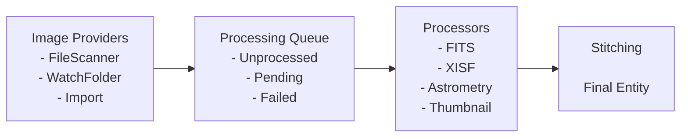

# Backend Architecture

This document describes the detailed architecture of the Sidereal backend, including the entity-based API design and the pluggable ingestion orchestrator system.

## Overview

The backend serves two primary functions:

1. **Entity API** — A RESTful API for managing domain entities (Images, Users, Albums, Equipment, etc.)
2. **Ingestion Orchestrator** — A pluggable system for ingesting, processing, and enriching entities from various sources

## Entity-Based API

### Core Entities

The backend exposes APIs for the following domain entities:

| Entity | Description | Key Fields |
|--------|-------------|------------|
| **Image** | Astronomical image with metadata | path, format, dimensions, captureDate, equipment |
| **User** | System user | email, name, preferences |
| **Album** | Collection of images | name, description, images |
| **Equipment** | Telescopes, cameras, filters | type, manufacturer, model, specs |
| **Target** | Celestial objects | name, type, coordinates, catalog references |

### API Design Patterns

#### Resource Naming

All entity APIs follow RESTful conventions:

```
GET    /api/{entity}           # List entities (with pagination/filtering)
POST   /api/{entity}           # Create entity
GET    /api/{entity}/:id       # Get single entity
PUT    /api/{entity}/:id       # Update entity
DELETE /api/{entity}/:id       # Delete entity
```

Example endpoints:
- `GET /api/images?target=M31&equipment=123`
- `POST /api/albums`
- `GET /api/equipment/456`

#### Response Format

All API responses use the standardized `ApiResponse<T>` wrapper:

```typescript
interface ApiResponse<T> {
  success: boolean;
  data?: T;
  error?: string;
  timestamp: string;
}
```

Success response:
```json
{
  "success": true,
  "data": { "id": "123", "name": "Orion Nebula" },
  "timestamp": "2024-01-15T10:30:00Z"
}
```

Error response:
```json
{
  "success": false,
  "error": "Image not found",
  "timestamp": "2024-01-15T10:30:00Z"
}
```

#### Pagination

List endpoints support cursor-based pagination:

```typescript
interface PaginatedResponse<T> {
  items: T[];
  cursor?: string;
  hasMore: boolean;
  total?: number;
}
```

Request: `GET /api/images?cursor=abc123&limit=50`

#### Filtering and Sorting

List endpoints support query parameter filtering:

```
GET /api/images?equipment=123&target=M31&sort=-captureDate&limit=20
```

- Exact match: `?field=value`
- Multiple values: `?field=value1,value2`
- Date range: `?from=2024-01-01&to=2024-02-01`
- Sorting: `?sort=field` (ascending) or `?sort=-field` (descending)

### Entity Relationships

Entities reference each other through IDs. The API supports expanding related entities:

```
GET /api/images/123?expand=equipment,target
```

Response includes nested related entities rather than just IDs.

---

## Image Ingestion Orchestrator

The ingestion orchestrator is responsible for discovering, importing, and enriching images from external sources with additional metadata and relations.

### Architecture Overview



### Core Components

#### 1. Image Providers

Image Providers are the sources of raw image metadata. They discover images from external systems and emit them into the processing queue.

**Responsibilities:**
- Connect to external data sources (filesystem, cloud storage, APIs)
- Discover new images
- Emit raw image metadata with minimal validation
- Track what has been ingested (for incremental updates)

**Built-in Providers:**

| Provider | Description | Trigger |
|----------|-------------|---------|
| `FileSystemScanner` | Scans directories for image files | Manual/Scheduled |
| `WatchFolderProvider` | Monitors folders for new files | File system events |
| `ImportProvider` | Handles manual file uploads | User action |

#### 2. Processing Queue

The processing queue tracks images through their lifecycle:

| State | Description |
|-------|-------------|
| `unprocessed` | Newly ingested, awaiting processing |
| `processing` | Currently being processed |
| `processed` | Successfully processed |
| `failed` | Processing failed (with error details) |

The queue supports:
- Priority ordering
- Retry logic with backoff
- Dead-letter handling for persistent failures
- Distributed processing across multiple workers

#### 3. Image Processors

Processors transform raw image data into enriched, validated image entities. They run in sequence and can emit additional entities or relations.

**Responsibilities:**
- Parse and extract metadata from files
- Validate entity data
- Enrich image entities with computed/derived metadata
- Emit related entities (e.g., thumbnails, calibration frames, equipment, targets, etc.)
- Report errors for failed processing

**Built-in Processors:**

| Processor | Description | Input | Output |
|-----------|-------------|-------|--------|
| `FITSHeaderProcessor` | Extracts FITS header metadata | Image Entity | Enriched metadata |
| `XISFProcessor` | Parses XISF file metadata | Image Entity | Enriched metadata |
| `ThumbnailProcessor` | Generates preview images | Image Entity | Thumbnail references |
| `AstrometryProcessor` | Plate solves images | Image Entity | WCS coordinates |
| `ObjectIdentifier` | Identifies celestial objects | Image with WCS | Target relations |

**Processing Characteristics:**
- Processors are invoked in registered order
- Each processor can modify the entity or pass it through unchanged
- Processing is idempotent (re-processing produces same result)
- Processors should be stateless (use cache for optimization)

#### 4. Stitching

Stitching is the final assembly step that combines:
- The processed entity data
- All emitted relations (incoming and outgoing)
- Any processing errors

### Processing Flow

1. **Ingestion**: Provider emits raw entity with basic structure
2. **Validation**: Schema validation (required fields, types)
3. **Queue**: Entity enters processing queue with `unprocessed` status
4. **Processing**: Each processor runs in sequence:
   - Processor examines entity kind/type
   - If applicable, processes and emits result
   - Can emit relations, errors, or discovered entities
5. **Stitching**: Assemble final entity with all relations
6. **Storage**: Persist to database, update search index
7. **API**: Entity available through REST API

### Error Handling

Processing errors are categorized:

| Type | Description | Action |
|------|-------------|--------|
| `validation` | Entity structure invalid | Reject, don't retry |
| `transient` | Temporary failure (network, etc.) | Retry with backoff |
| `permanent` | Cannot process (corrupt file, etc.) | Mark failed |

Failed entities retain their last successful state (if any) and include error details in the stitched result.

---

## Future Considerations

### Scalability

- **Distributed Processing**: Workers can run on multiple nodes
- **Queue Backend**: Replace in-memory queue with Redis/PostgreSQL
- **Incremental Ingestion**: Delta mutations for large datasets

### Additional Processors

- **AI Object Detection**: Identify objects without plate solving
- **Quality Analysis**: Score image sharpness, noise, tracking
- **Stacking Detection**: Group related sub-exposures
- **Weather Integration**: Enrich with atmospheric conditions

### Additional Providers

- **Cloud Storage**: AWS S3, Google Cloud Storage
- **PixInsight Integration**: Import from PI projects
- **NINA Integration**: Sync with N.I.N.A. session data
