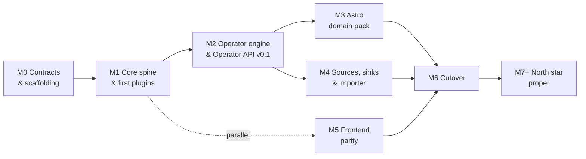

## Problem

Sidereal today is a **viewer over an Immich library**. Its data model has exactly one asset concept —
an `Image` synced from Immich, already finished, with plate-solve results attached. Immich is the
source of truth; Sidereal mirrors it read-only, and an asset vanishing from Immich deletes the
Sidereal record.

That model cannot express the hobby. Astrophotography produces:

- **Calibration frames in sets** — 50 darks at a given temperature, gain, and exposure; masters
  derived from them and reused across months of sessions.
- **Lights by the hundreds per session**, as FITS/XISF, long before anything is presentable.
- **Stacked results with provenance** — "these 187 lights, this master dark, this master flat,
  integrated on this date."

None of that fits a flat table of finished photos. The most valuable question a user can ask —
*"what did I use this master dark on, and is it still valid for this camera at this temperature?"* —
is unanswerable today, because lineage isn't modelled at all.

Separately, the current implementation has accumulated structural debt documented in detail in the
[behavioural specification package](https://github.com/sidereal-io/sidereal-analysis): unvalidated
write surfaces (`OQ-09`), silent editor failures (`OQ-10`), a double solving agent in Docker
(`OQ-07`), no PostgreSQL migration coverage (`OQ-11`), and an entirely unauthenticated surface
including full database download (`OQ-01`).

## Goal / Non-goals

### North star

**Product:** an astrophotography imaging pipeline that manages photos at *all* stages of the hobby —
calibration frames, raw lights, stacked results, annotated finals.

**Codebase:** a rewrite with a
**[Rust backend](https://github.com/sidereal-io/sidereal/blob/main/docs/decisions/ADR-009-backend-language.md)**,
a **plugin system** for integrating input and output formats and operations, and a **web frontend** for
managing the pipeline and its rich metadata.

### Goals

- Model assets, sessions, **lineage**, and operation runs as first-class concepts.
- Make Sidereal the **system of record for files on disk** — it renames, moves, and organises them.
- Make every pipeline action a **plugin**: plate solve, rename, move, tag today; Siril invocation and
  AI/face detection later.
- Keep the core **domain-agnostic**, with astrophotography as the first domain pack.
- Support **parallel contribution** — the frontend stays TypeScript/React and is not blocked on the
  backend rewrite.

### Non-goals

- **Sidereal does not do the math.** Calibration, registration, and integration stay in
  Siril/PixInsight/APP. Sidereal may *orchestrate* them via plugins; it does not reimplement them.
- **Not an Immich replacement — yet.** The core is built so it doesn't *forbid* general media
  management (family photos, faces, dedup), but that future is explicitly unfunded by this roadmap.
  Immich's hard parts are ML at scale, mobile apps with background upload, and multi-user sharing;
  none are needed for the astro product and any would eat a year.
- **No user-authored processing policies before cutover.** *(Refined by
  [ADR-006](https://github.com/sidereal-io/sidereal/blob/main/docs/decisions/ADR-006-rule-engine-deferral.md).)*
  v2.0 processing is **declarative** — built-in domain-pack policies declare outcomes and a reconciler
  dispatches Operators to satisfy them; operations are not hand-sequenced individually. Only
  *user-authored* policy rules and their editor land in M7+.
- **No API compatibility with v0.10.x.** See below.

## Migration Milestones

Critical path is **M0 → M1 → M2**. If the plugin interface is wrong, we find out at M2 rather than M6.

| Milestone | Exit criterion |
|---|---|
| **M0** Contracts & scaffolding | All M0 ADRs accepted, including security and plugin grants; embedded-script/`AssetContext` spike complete; CI green; a contributor goes zero-to-running in one command |
| **M1** Core spine & first plugins | Drop a file in a watched folder → it appears in the UI with extracted metadata, entirely through plugin contracts |
| **M2** Operator engine & API v0.1 | Operator API, `AssetContext`, selector contract, side-effect protocol published; four built-ins consume it, ≥2 through the embedded script profile; durable goals, reconciliation, and recovery-after-missed-events proven |
| **M3** Astro domain pack | Source facets + built-in policy converge a full session — lights + darks + flats → grouped, masters matched, lineage recorded |
| **M4** Sources, sinks & importer | A real v0.10.x install imports cleanly and reports what didn't map |
| **M5** Frontend parity | Every non-negotiable cutover item green (starts at M1, parallel to backend) |
| **M6** Cutover | Docker parity, migration guide, beta with real users, `v2.0.0` |
| **M7+** North star proper | User-authored policies · Siril/PixInsight · AI plugins · general-media pack exploration |

**M5 starts at M1**, not last — the frontend is a separate workstream against the HTTP API and stays
TypeScript/React. This is the single most important scheduling decision in the plan: it keeps existing
frontend contributors productive through a backend language switch.

## Migration Cutover

v2 is a new data model. The strategy is a **clean break with a one-way importer**, gated on a
non-negotiable feature set — the decision and its rationale are [ADR-010](../decisions/ADR-010-migration-strategy.md); 
this doc owns the execution. The TypeScript app moves to maintenance (security and critical fixes only) and is retired 
at cutover. The importer reads an existing SQLite/Postgres database and storage tree and produces v2 assets — best-effort, 
lossy where the models genuinely differ, and it **emits a report of exactly what didn't map**.

### Non-negotiable before cutover

An existing user would consider the upgrade broken without these:

- [ ] Gallery browse / filter / search with deep links
- [ ] Image detail view and metadata editing
- [ ] Deep-zoom viewer
- [ ] Plate solving, single and bulk
- [ ] Targets: catalog browse, visibility, annotations
- [ ] Equipment and equipment groups
- [ ] Acquisition entries and integration totals
- [ ] Immich sync as a source
- [ ] Admin configuration UI with connection tests
- [ ] Docker parity — port 5000, volume mounts, PUID/PGID, healthcheck
- [ ] Saved locations and their session relationships
- [ ] One-way importer from v0.10.x with dry-run and reconciliation report

**Should-have, not blocking:** sky map with FOV overlay · notifications · live job updates · dashboard
stats.

**Compatibility breaks pending a deployment survey/data scan:** XMP sidecar generation · standalone
worker mode. Current evidence shows uncertain lifecycle or usage, not absence of users. Survey
deployments and inspect available configuration/telemetry before accepting the break; if dropped, the
importer reports affected records explicitly.

**Explicitly dropped:** the database-download API endpoint (unauthenticated full-database download;
replaced by documented volume backup) · legacy free-text `telescope`/`camera`/`mount` fields (superseded
by equipment relations).

### Filesystem safety

M1–M5 builds operate only on copied or disposable storage roots. They never rename, move, or delete
irreplaceable originals. The importer is read-only against the source tree, supports dry-run and resumable
execution, records legacy-ID mappings, verifies checksums, and reconciles source/destination counts. Its
hard invariant: every irreplaceable local or URL original is either imported and verified or named in the
failure report — an unaccounted original blocks cutover.

### Rollback

- **Before M6:** discard the disposable v2 root; v0.10.x and its source tree remain untouched.
- **At M6:** the migration guide requires a verified database and storage backup before import.
- **After cutover:** rollback restores that backup. The importer is one-way by design.

A verified backup covers **both** stores: the PostgreSQL database (via `pg_dump` or a volume snapshot —
ADR-004 makes Postgres the only engine) **and** the v2 asset-storage root on disk. Neither alone is
complete, and the SQLite-era file-copy guidance no longer covers the database.
