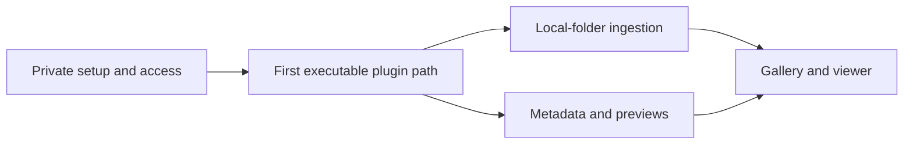

# v2 roadmap and migration

Sidereal v2 will manage local astrophotography files from ingestion through viewing,
organization, planning, and provenance. Local files lead delivery; Immich becomes a
plugin integration. The Rust backend and shared React frontend develop together.

This roadmap replaces the original post-M0 M1–M7 sequence. The confirmed scope and
planning checkpoint are in [discovery #347](https://github.com/sidereal-io/sidereal/issues/347).
The seven groups below are **capabilities**. Feature epics deliver them in smaller
increments, with explicit prerequisites. All seven must meet their agreed exit
criteria before cutover or the end of v0.10.x maintenance.

## Why the rewrite exists

v0.10.x presents finished images from Immich. It cannot represent a night's raw
frames, reusable calibration masters, or the exact inputs behind a derived image.
The v2 library must hold raw, derived, and finished assets, with stable identities,
immutable byte versions, searchable metadata, and lineage.

Core remains domain-agnostic. Astronomy vocabulary and behavior belong to the astro
pack; first-party and third-party processing use the same public plugin boundary.
Core manages stored bytes and validates plugin requests. Calibration, registration,
and integration mathematics stay in external tools.

The [architecture map](../docs/architecture.md) owns the technical concepts and
accepted decisions. The [discovery map](discovery.md) owns personas and journeys.
This document owns delivery coverage, sequencing, and migration readiness. GitHub
issues own the executable backlog.

## Starting point

**M0 scaffolding is complete.** The Rust workspace, crate boundaries, registration
stubs, health endpoint, React web shell, development commands, and CI exist. Keep
that completed work.

Scaffolding does not supply executable Source/Operator/Sink contracts, persistent
assets, processing, or authentication. Those are explicit enabling work in the
feature epics below. The scripting engine remains
[Proposed](../docs/decisions/ADR-012-embedded-scripting-engine.md); its spike and
acceptance decision precede dependent implementation. The
[security decision](../docs/decisions/ADR-007-security-and-plugin-trust.md) supplies
mandatory gates before dependent file and plugin behavior.

Preserve [#337](https://github.com/sidereal-io/sidereal/issues/337), the ongoing design
system work. Screens follow [`DESIGN.md`](../DESIGN.md) and
[ADR-005](../docs/decisions/ADR-005-visual-design-system.md): code and Penpot follow
the repo-defined tokens and rules. Legacy behavior is evaluated screen by screen;
visual values come from the v2 design system. Components are built for their first
consumer screens. A screen needs its tokens and components, not completion of every
future design-system story.

## How delivery is organized

| Unit | Purpose |
|---|---|
| Capability | A coherent area of product behavior spanning multiple feature epics. |
| Epic | A feature or enabling proof with a specific demonstration and exit criterion. |
| Story | One thin, demoable OpenSpec change with a self-contained issue packet. |
| Release milestone | A checkpoint grouping the work required for a particular release. |

Keep dependencies at the level they apply:

- An epic blocked by another epic carries that relationship on the epic.
- Stories that depend on other stories in the same epic carry story-level blockers.
- A story cannot start while its parent epic has an open blocker. Backlog selection
  must inspect ancestor blockers as well as the story's own links. The OpenSpec
  backlog-selection instructions in `config.yaml` include this check.
- Scope a dependent epic around its actual prerequisite. A consumer of the trusted
  built-in profile does not need to wait for the whole custom-plugin capability.

The tables below are **draft epic scopes**, not filed issues or prewritten OpenSpec
changes. Planning keys such as `L2` identify dependencies in this document; they are
not milestone numbers. Refine each epic's demonstration and exclusions, then file
its issue and native blocker links. Cut its stories during exploration. Evaluate
individual v0.10.x behaviors there, deciding which to retain, change, or defer.

All seven capability groups are required for cutover. Stories required by their
agreed exit criteria keep the repo's `priority/must` label and matching MoSCoW line.
Optional enhancements are evaluated within their epics; broad capability coverage
does not make every possible feature mandatory.

## Capability coverage

| Capability | Outcome before cutover |
|---|---|
| **1. View a local library** | Safely ingest local images, browse previews, open a zoomable viewer, and inspect extracted metadata. The first demonstration uses PNG, JPEG/JPG, and TIFF. |
| **2. Describe and find images** | Add tags and editable metadata, then search and combine criteria. Describe and Find are separate feature epics. |
| **3. Extend processing** | Install and configure a custom plugin, approve its grants, run it, and inspect results, errors, and cancellation. |
| **4. Plan and explore the sky** | Use astro-format metadata and previews, equipment and sites, targets and visibility, plate solving, captured sky coverage, and annotations. |
| **5. Understand an imaging session** | Classify and group frames, inspect integration totals, match calibration, and trace the inputs behind derived images. |
| **6. Connect and publish** | Import through the Immich Source and publish selected images or metadata through its Sink. |
| **7. Upgrade and cut over safely** | Diagnose storage problems, verify backup/restore, migrate an existing installation, and pass release-readiness checks. |

The astro pack owns capabilities 4–5's domain behavior and astronomy-format
interpretation wherever those features appear. Core owns generic assets, versions,
facets, collections, processing, and lineage storage. Immich is its own integration
plugin. Every capability includes the shared React interfaces its users need.

## Feature epics and prerequisites

### 1. View a local library

The first usable path goes from a local ordinary image to a protected, managed asset
with metadata and a browser viewer. Introduce executable contracts through a real
consumer before dependent features use them. Grow those contracts as needed.

| Key | Draft epic and demonstration | Prerequisites |
|---|---|---|
| L1 | **Private setup and access.** An administrator completes setup, signs in and out, and sees unauthorized access and mutations refused. | ADR-007 security gates; design-system work for the setup/sign-in screens. |
| L2 | **First executable plugin path.** A test/manual Source feeds one ordinary image through core-managed storage and an Operator; a protected read shows its immutable version, validated metadata, and recorded processing outcome. | L1. Defines initial contracts, contexts, registration, schema/provenance validation, persistence, and the smallest durable processing path. |
| L3 | **Managed local-folder ingestion.** Files discovered in a configured folder become managed assets safely, preserve source identity, and reconcile after restart. | L2. |
| L4 | **Ordinary-image metadata and previews.** PNG/JPEG/TIFF inputs produce inspectable metadata and viewable previews without altering originals. | L2. |
| L5 | **Gallery and zoomable viewer.** A person browses ingested images, opens a deep link, zooms/pans, and inspects metadata and processing state. | L3, L4; the screen's design-system components. |

```mermaid
flowchart LR
    L1[Private setup and access] --> L2[First executable plugin path]
    L2 --> L3[Local-folder ingestion]
    L2 --> L4[Metadata and previews]
    L3 --> L5[Gallery and viewer]
    L4 --> L5
```

Astronomy/raw formats are outside this initial demonstration. FITS/XISF header
interpretation and rendering belong to astro-pack epics. The minimal processing
path follows the accepted goal/reconciliation model; later epics extend it.

### 2. Describe and find images

| Key | Draft epic and demonstration | Prerequisites |
|---|---|---|
| D1 | **Describe images.** A person edits names, descriptions, tags, and additional metadata through authorized mutations; extracted observations remain distinguishable from user intent. | L5 and the initial facet/mutation contracts. |
| D2 | **Find images.** A person searches and combines filters over registered fields, with usable navigation and clear handling of unavailable criteria. | L5 and queryable facet schemas. Specific criteria are supplied by their producing epics. |

Find uses registered schemas rather than hardcoded astronomy fields in core. Tags
and astronomy criteria become usable when their providers exist. Scope later query
features with their provider dependencies; generic retrieval need not wait for the
whole astro pack. Saved or bookmarked criteria must handle missing or incompatible
fields explicitly.

### 3. Extend processing

| Key | Draft epic and demonstration | Prerequisites |
|---|---|---|
| E1 | **Embedded runtime proof and decision.** A real plugin proves cancellation, resource limits, async host calls, manifest loading, and the context boundary; the scripting ADR is decided. | L2. The ADR must become Accepted before dependent implementation is designed. |
| E2 | **Install, configure, and grant a plugin.** An administrator sees requested capabilities, supplies configuration, approves grants, and can revoke them. | E1; existing access and grant enforcement. |
| E3 | **Run and inspect a custom plugin.** An installed plugin produces validated results; denial, failure, progress, cancellation, and bounded execution are demonstrated through conformance checks. | E2; executable contracts and durable processing from L2. |
| E4 | **Connect to external services securely.** A real built-in plugin uses approved HTTP destinations and scoped secrets; refused access and redacted failure/progress output are observable. | L1, L2; provider/secret security gates. |

E4 is a shared enabling epic for solving and Immich. It can proceed independently of
the embedded runtime. This avoids making a trusted HTTP integration wait for all
custom-plugin installation work. The first consuming integration supplies its
bounded proof; the epic does not promise every external-provider adapter in advance.

Basic validation and recovery start with L2. E3 adds evidence for the untrusted
execution profile; it does not postpone all conformance until extension support.

### 4. Plan and explore the sky

| Key | Draft epic and demonstration | Prerequisites |
|---|---|---|
| A1 | **Astronomy-format metadata and previews.** A person imports supported astro files, sees domain metadata, and opens their previews while originals remain intact. | L2, L4; L5 for the viewing demonstration. Select supported formats and rendering behavior during exploration. |
| A2 | **Equipment and observing sites.** A person maintains equipment, groups, and named sites through astro-owned contracts and shared interfaces. | L2; required domain-contract extensions and screen components. |
| A3 | **Targets and visibility.** A person browses targets and evaluates visibility for a chosen site and time. | A2 for site-specific visibility; catalog and domain-query behavior are owned here. |
| A4 | **Plate solving.** A person submits an image or batch, follows progress/failure, and inspects a recorded solution. | L4, L5, E4; astronomy schema and asynchronous-run support before solver calls. |
| A5 | **Captured sky coverage and annotations.** A person explores positioned images on an interactive atlas, opens them in the viewer, and inspects object annotations. | A4 for the first solution-backed demonstration; L5. Other coordinate providers can be added deliberately. |

Keep these as separate astro-pack features. Equipment and catalog work can proceed
without waiting for all solving behavior. Unsolved images remain accessible in the
library. Field-of-view planning and other legacy details receive explicit inclusion
or deferral decisions during the relevant epic's exploration.

### 5. Understand an imaging session

| Key | Draft epic and demonstration | Prerequisites |
|---|---|---|
| S1 | **Frame/session organization and totals.** A person classifies frames, associates sessions with targets/equipment/sites, and inspects integration totals. | A1, A2; immutable collection/membership support and the domain fields actually used. |
| S2 | **Calibration relationships.** A person finds compatible calibration frames or masters using recorded properties and sees why they match. | S1; validated frame/camera/exposure properties from A1. |
| S3 | **Derived-image lineage.** A person records and inspects the exact input/output versions behind a derived image; output bytes enter managed storage through core. | L2, S1; the public lineage/output contract and storage support introduced by this epic. |

Core stores collections and version edges. The astro pack interprets frame types,
compatibility, sessions, and totals. Sidereal records or orchestrates external
processing; these epics do not implement scientific calibration or integration.

### 6. Connect and publish

| Key | Draft epic and demonstration | Prerequisites |
|---|---|---|
| I1 | **Immich Source import.** An administrator configures Immich and brings images into the managed library with retained remote identity and visible import failures. | L5, E4; Source contract extensions required by this integration. |
| I2 | **Sink proof and Immich publishing.** A person publishes selected images or metadata and can inspect success, failure, and ambiguous completion without duplicate external effects. | L5, E4; define and prove the initial Sink contract before publishing behavior uses it. |

Source and Sink are separate deliverables of the same integration plugin. Remote
removal does not delete a managed original. Metadata writeback and synchronization
policy receive explicit scope decisions here rather than inheriting the old app's
behavior automatically.

### 7. Upgrade and cut over safely

| Key | Draft epic and demonstration | Prerequisites |
|---|---|---|
| O1 | **Diagnose and repair.** A person detects missing/corrupt stored objects and deliberately restores, adopts, or ignores a mismatch while preserving history. | L3 and managed-storage provenance. |
| O2 | **Verified backup and restore.** An administrator backs up PostgreSQL and asset storage, restores them, and verifies a usable library. | L3. Refresh the verification against the complete delivered feature set before cutover. |
| O3 | **Legacy importer.** An administrator runs a read-only dry run and resumable import, then reviews verified originals, mapped records, and named failures. | L5 and the destination epics for records included in the mapping. Identify those blockers when the mapping is scoped. |
| O4 | **Readiness and cutover.** A real upgraded installation demonstrates the agreed capability exits, installation/configuration, import accounting, and recovery before v0 maintenance ends. | Capability 1–6 exits; O1, O2, O3; migration/release documentation and deployment verification. |

Operational behavior starts when its first feature needs it. Final readiness
verifies the assembled product rather than adding authentication, storage safety,
or recovery for the first time. O4 checks the other required feature epics; it is
the final gate, not a dependency on its own completion.

## Releases and GitHub milestones

WIP, alpha, and beta versions can be released as features become usable. Each release
states its delivered capabilities, missing features, contract versions, and known
compatibility limits. Preview status does not waive security or original-safety gates.

Public availability and API stability are separate decisions. Preview plugin
contracts may change. A stable designation needs real consumer and conformance
evidence, including the embedded-profile requirement in
[ADR-001](../docs/decisions/ADR-001-plugin-boundary.md). This roadmap does not prescribe
npm, a plugin registry, or a marketplace.

GitHub milestones group work for release checkpoints; capability issues and feature
epics organize ownership and dependencies. No GitHub milestone objects have been
created by this replanning yet. The proposed first milestone is **v2 cutover**.
Define alpha/beta milestones when their scope and exit criteria are chosen. There
are no committed dates or version numbers for these checkpoints.

The old M1–M7 parent issues and open M1 stories are closed as superseded by #347.
Their packets do not constrain this plan. Completed work and accepted ADRs remain
valid. Fresh capability and epic issues are previewed before filing; the issue
backlog remains in discovery until their scope and blocker links are concrete.

## Cutover and migration safety

The strategy remains a clean break with a one-way importer, governed by
[ADR-010](../docs/decisions/ADR-010-migration-strategy.md). v0.10.x receives security
and critical fixes until cutover. v2 is not API-compatible with it.

### Readiness checks

- [ ] Each of the seven capabilities meets its agreed epic exit criteria, with its
  frontend and plugin behavior demonstrated.
- [ ] Relevant v0.10.x behaviors have been evaluated in their owning epics. Retained,
  changed, and deferred behavior is recorded; migration consequences are accounted for.
- [ ] Deployment and administration are verified, including connections, PostgreSQL,
  port 5000, volume mounts, PUID/PGID, and health checks, with deliberate decisions on
  any deployment-contract changes.
- [ ] The importer supports dry-run/resume, reports unmapped records, verifies
  originals, and reconciles source/destination accounting.
- [ ] Backup/restore and rollback are demonstrated against the delivered product.
- [ ] Security gates, plugin conformance, processing recovery, and the required repo
  checks pass for the released capabilities.
- [ ] Release and migration guides describe capability coverage and compatibility
  limits before the decision to end v0 maintenance.

The interactive captured-image sky map is part of capability 4's required coverage.
Notifications, dashboard statistics, field-of-view overlays, sidecars, and standalone
worker behavior are evaluated in the relevant epics; this document does not silently
carry forward the retired priority list. Preserve any standing deployment survey or
usage check before accepting a compatibility break.

The unauthenticated database-download endpoint remains excluded; documented backup
and restore replace it. Legacy free-text equipment fields map to equipment relations
or appear in the import report, consistent with the accepted migration decision.

### Filesystem safety

Development and migration demonstrations use copied or disposable storage roots.
They never rename, move, or delete irreplaceable source originals. Plugins request
mediated operations; core owns protected asset storage.

The importer reads the old database and source tree without modifying them. It
supports dry-run and resumable execution, records legacy-ID mappings, verifies
checksums, and reconciles accounting. Every irreplaceable local or URL original is
imported and verified or explicitly named in the failure report. An unaccounted
original blocks cutover. Reported failures must be reviewed before accepting readiness.

### Backup and rollback

A complete v2 backup includes the PostgreSQL database, the asset-storage root, and
the deployment configuration and key material needed under the chosen secret-custody
design. Restored plugins must be able to access their intended credentials without
exposing them. The database or asset root alone is insufficient. The migration guide
requires a verified backup of the existing installation before import.

- **Before cutover:** discard the disposable v2 root; v0.10.x and its source tree
  remain untouched.
- **At cutover:** retain the verified database/storage backup and document the
  transition and rollback procedure.
- **After cutover:** rollback restores that backup. The importer is one-way.

## Beyond cutover

User-authored processing policies and their editor remain deferred by
[ADR-006](../docs/decisions/ADR-006-rule-engine-deferral.md). Scientific-tool
orchestration, AI plugins, and general-media exploration are future candidates,
not an eighth required capability. Multi-user sharing, mobile background upload,
a Rust dynamic ABI, and independently loaded frontend plugins are outside this plan.
